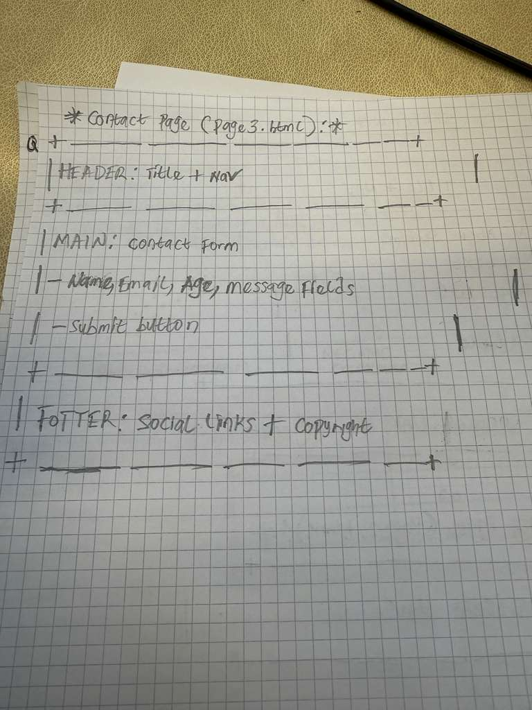

## Portfolio Purpose
The purpose of this portfolio website is to showcase my web authoring skills using HTML5 and CSS3. The website presents my personal entertainment recommendations, including music, movies, and games, while demonstrating my understanding of semantic HTML, layout structure, styling, and accessibility.

## Target Audience
The target audience for this website is young adults and students who are interested in entertainment recommendations. It is also aimed at my web development lecturer as evidence of my learning and practical skills in web authoring.

## Page Planning and Content

### index.html
The homepage introduces the website and presents my top entertainment picks. It includes sections for music, movies, and games, along with images and short descriptions. This page is designed to immediately engage the user and explain the purpose of the site.

### galleryreviews.html
This page focuses on detailed entertainment categories, such as favourite artists, top movies, and popular games. It includes lists and images to demonstrate different HTML elements and structured content.

### contact.html
This page is designed as a contact page. It includes a form where users can submit their name, email address, and a message. This page demonstrates form elements and user interaction.

## Design Decisions
I chose a dark-themed color scheme with contrasting text to create a modern and visually appealing entertainment website. Fonts were kept simple and readable to ensure accessibility. Spacing, padding, and margins were used consistently to keep the layout clean and organised.

## Navigation Structure
The website uses a navigation bar at the top of each page with links to all three pages. This ensures consistent navigation and allows users to move easily between sections of the site.

## Technologies and Tools
- HTML5
- CSS3
- Visual Studio Code
- GitHub and GitHub Pages
- Web browser developer tools

## HTML and CSS Evolution
HTML has evolved from a simple markup language used to structure text into HTML5, which includes semantic elements like header, nav, main, and footer. These elements improve accessibility and readability. CSS has also evolved significantly, allowing developers to control layout, colors, fonts, and responsiveness, separating content from presentation.

## HTML Tags Used
- <header>: Used to contain the site title and navigation.
- <nav>: Provides navigation links between pages.
- <section>: Groups related content such as music, movies, and games.
- <table>: Displays structured data for entertainment ratings.

## CSS Properties and Techniques
- background-color: Used to define the site’s color scheme.
- font-family: Ensures readable and consistent typography.
- margin and padding: Create spacing between elements.
- border-radius: Adds subtle styling to containers and images.

## *Sketches*
(insert the photo of sketches as a file on github.)

